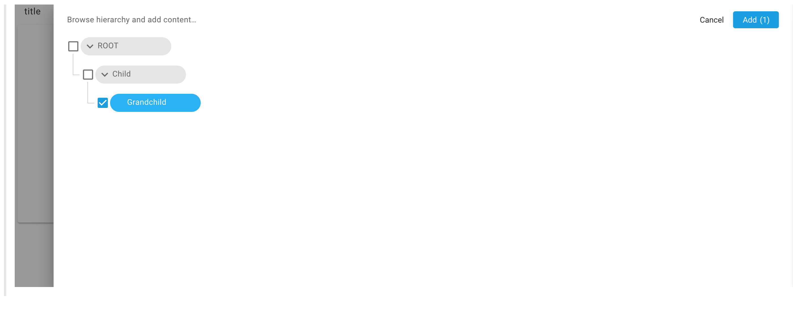

[](https://amplience.com/dynamic-content)

# dc-extension-hierarchy-chooser

> Allows users to browse and add content items from a hierarchy rather than having to find these items in the Content Library



## How to install

### Register the extension

This extension needs to be registered with a Hub within the Dynamic Content application (Development -> Extensions), for it to be available within that Hub. For step-by-step instructions, see [Amplience Docs - Using Hierarchies](https://amplience.com/docs/development/hierarchies/usinghierarchies.html#the-hierarchy-chooser-extension).

#### Settings

- `Category:` Content Field.
- `Label:` Hierarchy chooser _(this will appear under the 'add extension' dropdown in the schema editor)_.
- `Name`: hierarchy-chooser _(needs to be unique within the Hub)_.
- `URL`: https://hierarchy-chooser.extensions.content.amplience.net/.
- `Description`: Hierarchy chooser extension _(can be left blank if you wish)_.
- `Initial height`: 200.

**Note:** You can use our deployed version of this extension (builds from the 'main' branch) -

https://hierarchy-chooser.extensions.content.amplience.net/

_As this is an open source project you're welcome to host your own fork of the project. You can use any standard static hosting service (Netlify, Amplify, Vercel, etc.) if you wish._

#### Permissions

Give the extension the following permissions:

- Read access
- Allow same origin

#### Installation parameters

To use the hierarchy extension you need to include the content item id of the hierarchy node from which the hierarchy can be browsed in the extension params. Note that the nodeId can be overridden in the content type schema.

| Parameter | Default   | Notes                                                  | Required |
| --------- | --------- | ------------------------------------------------------ | -------- |
| nodeId    | undefined | The ID of the node to use as the root node of the tree | true     |
| type      | 'large'   | Display settings options: large, small, chip           | false    |

#### Example snippet

Optionally, you can add a schema snippet, which will be made available in the Schema editor.

```json
{
  "title": "title",
  "type": "array",
  "ui:extension": {
    "name": "<extension name>",
    "params": {
      "nodeId": "<root node ID>"
    }
  },
  "items": {
    "allOf": [
      {
        "$ref": "http://bigcontent.io/cms/schema/v1/core#/definitions/content-link"
      },
      {
        "properties": {
          "contentType": {
            "enum": ["https://example.schema.com"]
          }
        }
      }
    ]
  }
}
```

### Sample schema

```json
{
  "$schema": "http://json-schema.org/draft-07/schema#",
  "$id": "<schema name>",
  "title": "Title",
  "description": "Description",
  "allOf": [
    {
      "$ref": "http://bigcontent.io/cms/schema/v1/core#/definitions/content"
    }
  ],
  "type": "object",
  "properties": {
    "treeNodes": {
      "title": "title",
      "type": "array",
      "minItems": 2,
      "maxItems": 5,
      "ui:extension": {
        "name": "<extension name>",
        "params": {
          "nodeId": "<root node ID>",
          "type": "chip"
        }
      },
      "items": {
        "allOf": [
          {
            "$ref": "http://bigcontent.io/cms/schema/v1/core#/definitions/content-link"
          },
          {
            "properties": {
              "contentType": {
                "enum": ["https://example.schema.com"]
              }
            }
          }
        ]
      }
    }
  },
  "propertyOrder": []
}
```

## Running locally

### dev

```bash
$ npm run serve
```

### build

```bash
$ npm run build
```
